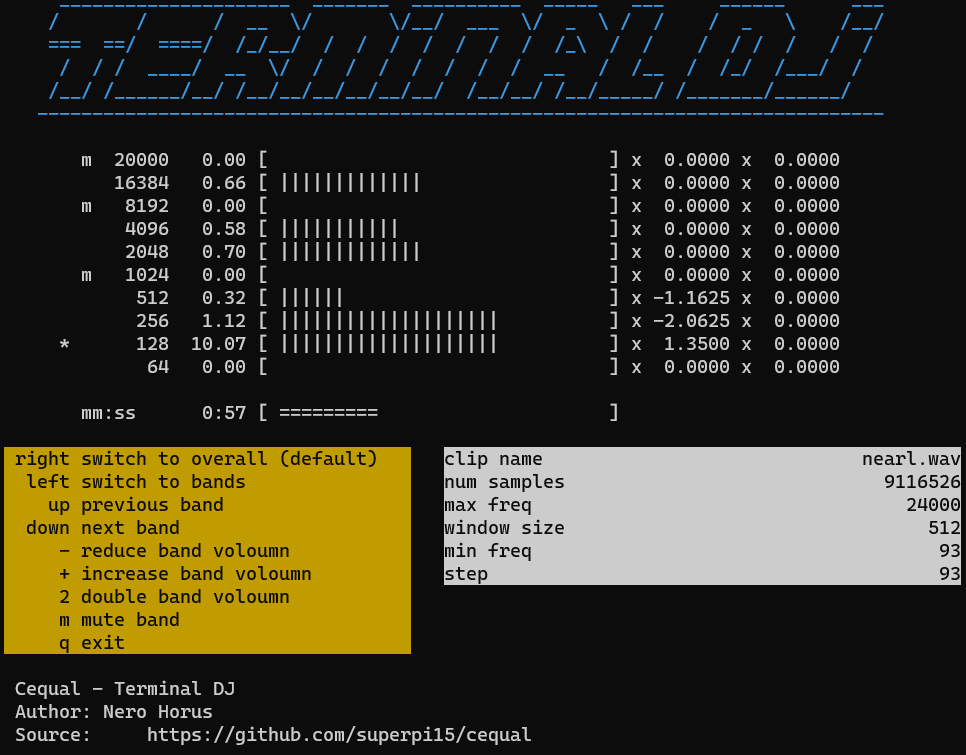

# Cequal - Terminal DJ



Cequal stands for: C-based equalizer for educational purpose. 

This equalizer demonstrates a typical conversion between time and frequency -domain, often applied to audio processing. 

It can amplify or decrease volumn in the selected bands. 

Better performance and higher spectrum resolution may be supported later. 

```diff
- Warning: gently adjust volumn especially in low frequncy 
```

## system prerequisite 

* pthread
* g++ 
* Open MP
* Open AL
* ncurses

## compile
```shell
sh compile.sh
```

## run 

```shell
./cequal <YOUR_WAV_FILE> [OUTPUT.WAV (optional)]
```
Output file by default is named *tmp.wav*.

## to do 

* better performance for higher spectrum resolution (to solve frequnecy leakage)
* refine ncurses refreshing synchronization 

This document is exported from: [https://github.com/superpi15/cequal/](https://github.com/superpi15/cequal/)


--- --- ---

## implementation notes 


 radians 


1Hz  6.28 rad/sec

In C math library, sine function takes radians as its input. 


A sample is a data of a time step. 
Given sample rate  
and sample index , 
the elapsed time is <br/>
<p align="center">

</p>

Consider a frequency from a selected set of band , the amplitude of sine function at the time is <br/>
<p align="center">

</p>

Shown above indicates that band frequency can be first converted into angular freqency 

to reduce computation overhead. 


### FFT 

Define 
}}), DFT has the form 

<p align="center">

</p>

Partition into even and odd part 

<p align="center">

</p>

Using the identiry 
})^2=e^{-j(2\pi/(N/2))}=W_{N/2}})

<p align="center">

</p>

Observe the elements crossing half window size

<p align="center">

</p>

Observe K+1-th term 

<p align="center">

</p>

Observe K+(N/4)-th term 

<p align="center">

</p>


